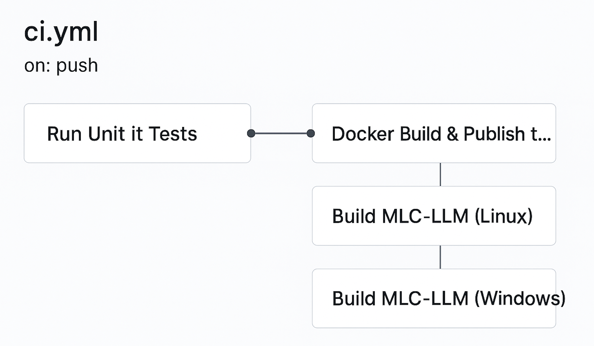

## **What is this?**

This repository has been created to demonstrate the tasks outlined in an assignment. It includes a copy of the original source:  https://github.com/mlc-ai/mlc-llm . In addition to the content from the original project, this repository also features supplementary work developed specifically to meet the assignment's deliverables.

## **Any Prerequisites?**

As this repo primarily deals with docker & github container registry (GHCR). There are mainly two prerequisites.

- Docker cli installed and available (```docker ps``` should work on your system)
- A Github PAT(personal access token), for pulling docker image to your local.

## **How to Pull the docker Image?**

This project builds a Docker image preconfigured with Python 3, Miniconda, Rust and several other dev dependencies. The idea is to use the docker image as a Development environment. Basically a single docker image that serves two purposes.

- An interactive shell, with all required tools to build/test MLC LLM.
- An unattended local build environment. Devs can trigger build locally without any interaction. 

You can pull this image to your local using the below command. 

```bash
docker pull ghcr.io/sarath-pillai/mlc-llm:latest
```

The above will prompt you for a username and password. Use your github username, and instead of password, use PAT. 

## **How to launch development environment (interactive shell) ?**

This step assumes the below. 
- You have cloned this repo locally. 
- You have pulled the docker image locally. 

```bash
docker run -v .:/workspace/mlc-llm -it ghcr.io/sarath-pillai/mlc-llm:latest DevEnvironment
==============================
 Welcome to MLC-LLM Dev Shell 
==============================
Source Dir      : /workspace/mlc-llm
Conda Env       : mlc-chat-venv
Python Version  : Python 3.11.13
CMake Version   : cmake version 3.25.1
Rust Version    : rustc 1.87.0 (17067e9ac 2025-05-09)
==============================
root@e32352e04240:/workspace/mlc-llm# 
```

You are now in an interactive shell with all required dependencies for dev work. 

## **How to launch a build environment (non interactive local build) ?**
This step assumes the below. 
- You have cloned this repo locally. 
- You have pulled the docker image locally. 


```bash
docker run -v .:/workspace/mlc-llm -it ghcr.io/sarath-pillai/mlc-llm:latest build
```

The above command will start the compilation process. 

## **How is CI/CD Implemented ?**

This repository includes a GitHub Actions workflow (`.github/workflows/ci.yml`) that automates testing, building, and packaging of the MLC-LLM project across platforms like Windows & Linux.

#### **How is the workflow Triggered ?**
The workflow is triggered when:
- Pushes to the `master` branch
- Creation of tags matching `v*` (used for releases)
- Pull requests targeting `master`

#### **How is the test cases Triggered ?**

There is a job named `test`. This is the very first job in the pipeline. This gets executed for each and every change in the repo (MRs & Pushes).

This job ensures correctness of unit tests and its coverage before any other stage in the workflow (It gates further stages):

- Executes tests via `ci/task/test_unittest.sh`

#### **How is the docker image built and pushed to GH container registry ?**
There is a job named `Docker Build & Publish to GHCR`. This job builds and publishes a Docker image to GitHub Container Registry (GHCR):

- Authenticates with GHCR using `GITHUB_TOKEN`
- Tags the image based on branch, tag, commit SHA, and `latest` if on the default branch
- Builds and pushes the image using Docker BuildKit with caching enabled

You can see docker images here: https://github.com/sarath-pillai/mlc-llm/pkgs/container/mlc-llm


#### 🏗️ **Job: Build on Linux (`build-mlc-llm-linux`)**
This job builds the MLC-LLM project and generates a Python wheel:

- Sets up the build environment and dependencies (e.g., `cmake`, `ninja`, `libopenblas`, etc.)
- Configures build options like `USE_CUDA`, `USE_VULKAN`, etc.
- Caches intermediate build files for performance
- Builds the C++ code with CMake
- Packages the Python wheel (`python/dist/*.whl`)
- If it's a release tag (`v*`), the wheel is uploaded to GitHub Releases

#### 🪟 **Job: Build on Windows (`build-mlc-llm-windows`)**
This job mirrors the Linux build but is tailored for Windows:

- Uses Miniconda to manage the environment (via `build-environment.yaml`)
- Runs the Windows build script (`ci\task\build_win.bat`)
- Builds and uploads the wheel on release tag

#### 🔒 **Permissions**
The workflow grants the following permissions:
- `contents: write` – required for uploading release assets
- `packages: write` – required for pushing Docker images to GHCR

---

#### 📦 **Release Artifacts**
If a release tag (e.g., `v1.0.0`) is pushed:
- Docker image is tagged and pushed to `ghcr.io/sarath-pillai/mlc-llm`
- Python wheels (`.whl` files) for both Linux and Windows are uploaded to the GitHub Release

You can find the latest releases here: https://github.com/sarath-pillai/mlc-llm/releases

#### CI/CD Flowchart

This diagram illustrates the workflow defined in `.github/workflows/ci.yml`:


---
